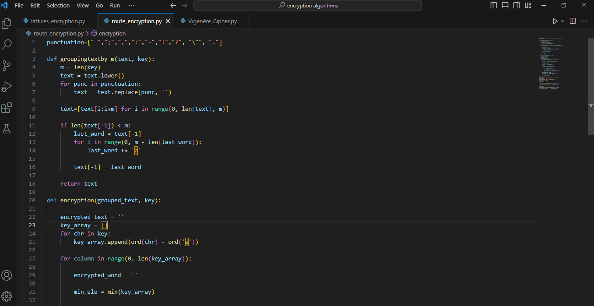
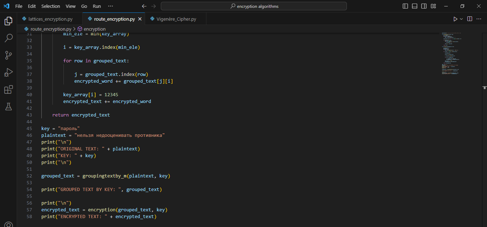
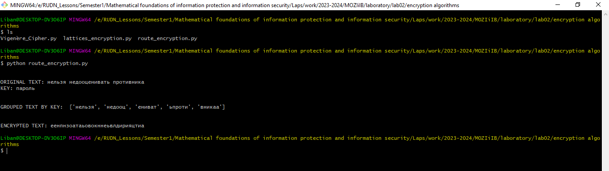
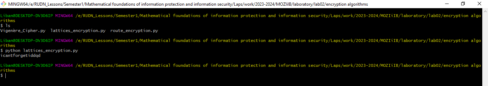
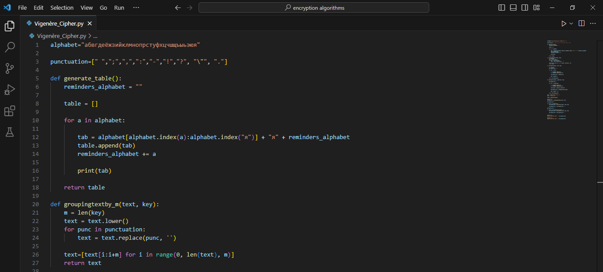
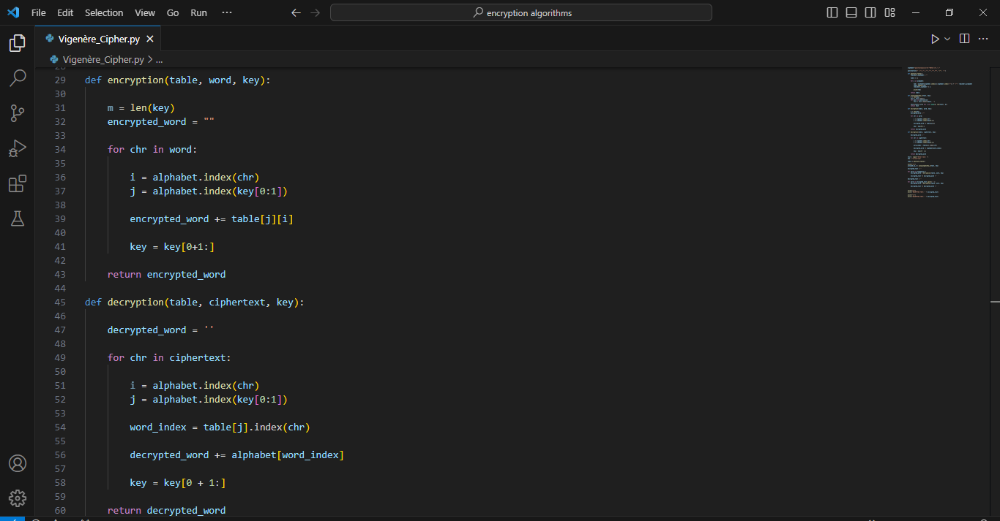
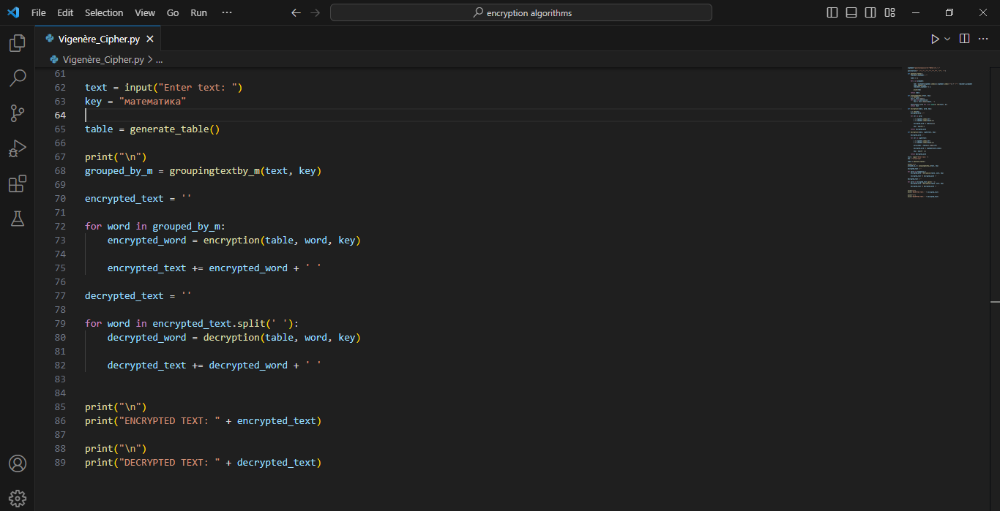
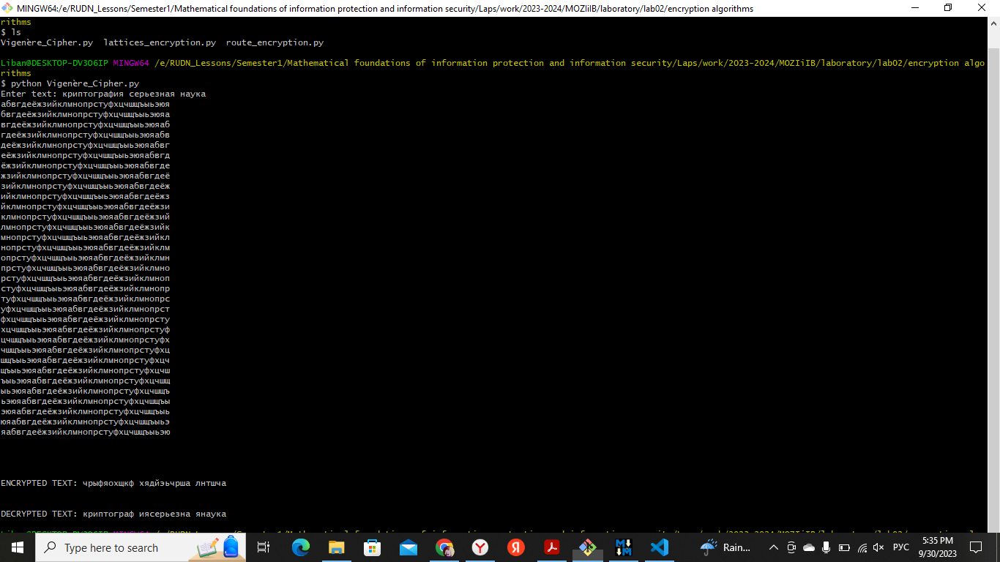

---
## Front matter
lang: ru-RU
title: Математические основы защиты информации и информационной безопасности. Отчет по лабораторной работе № 2 на тему "Шифры перестановка"
author: Мохамед Либан Абдуллахи
group: НФИмд-01-23
institute: Факультет физико-математических и естественных наук, РУДН.

## Formatting
toc: false
slide_level: 2
theme: metropolis
header-includes: 
 - \metroset{progressbar=frametitle,sectionpage=progressbar,numbering=fraction}
 - '\makeatletter'
 - '\beamer@ignorenonframefalse'
 - '\makeatother'
aspectratio: 43
section-titles: true
---

# Содержание
* Цели и задачи
* Выполнение марширутное шифрование
* Результаты марширутное шифрование
* Выполнение шифрование с помощью решеток
* Результаты шифрование с помощью решеток
* Выполнение таблица виженера
* Результаты таблица виженера
* Список литературы

# Цели и задачи
Освоить на практике применение Шифры перестановка используя методы марширутное шифрование, шифрование с помощью решеток и таблица виженера.

# Выполнение марширутное шифрование

## Результаты марширутное шифрование

# Выполнение шифрование с помощью решеток

## Результаты шифрование с помощью решеток

# Выполнение таблица виженера

## Результаты таблица виженера

# Выводы
Освоено на практике применение Шифры перестановка используя методы марширутное шифрование, шифрование с помощью решеток и таблица виженера.

# Список литературы
1. Методические материалы курса