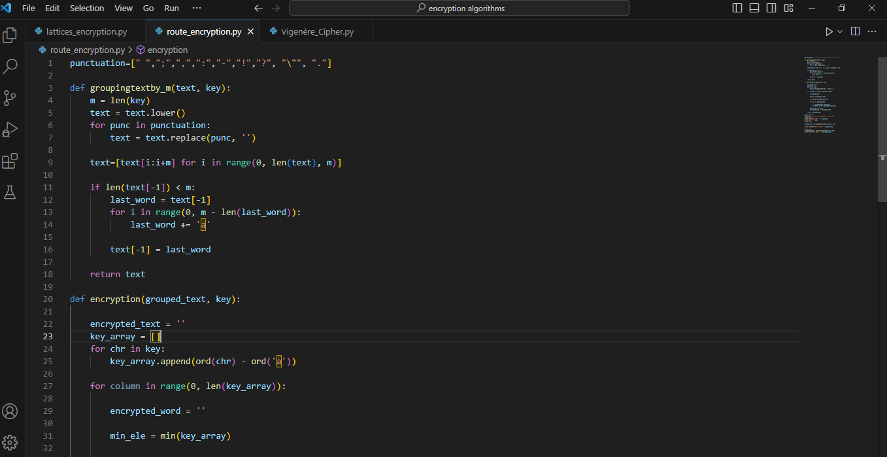
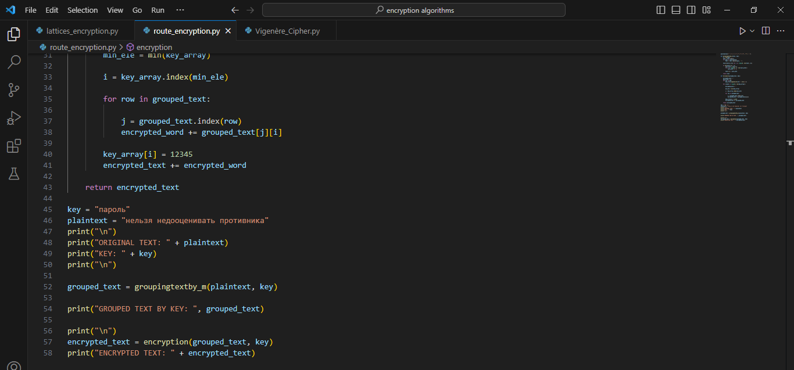
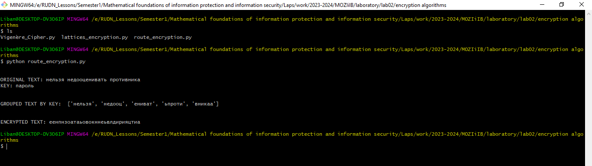
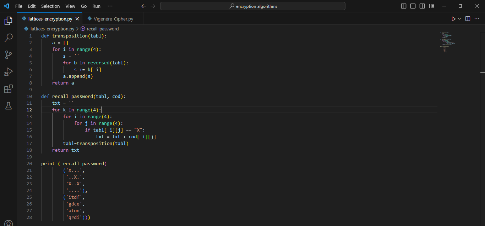
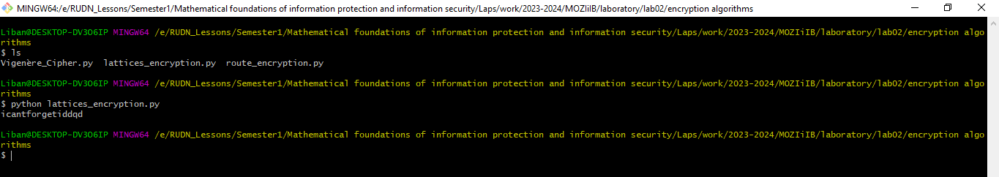
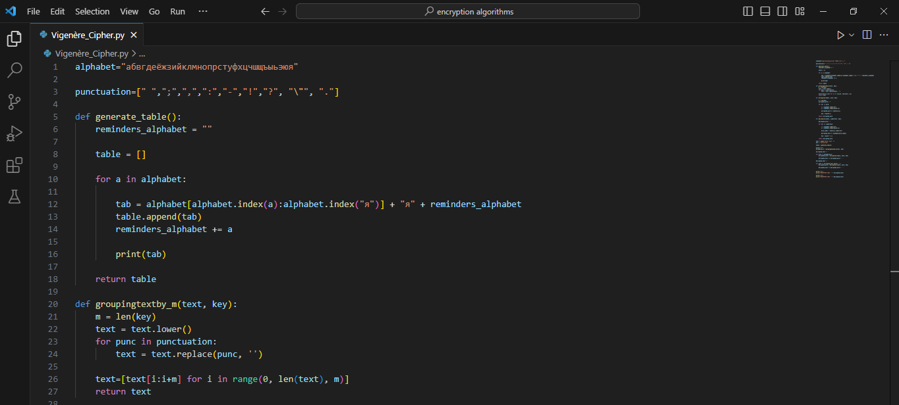
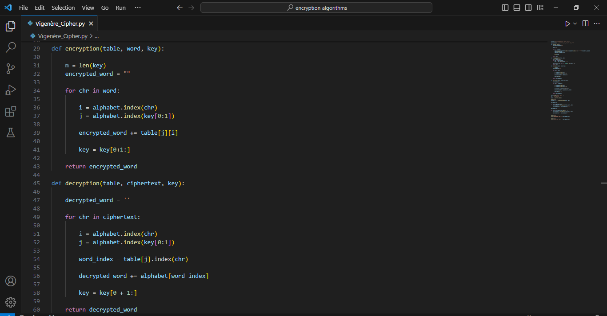
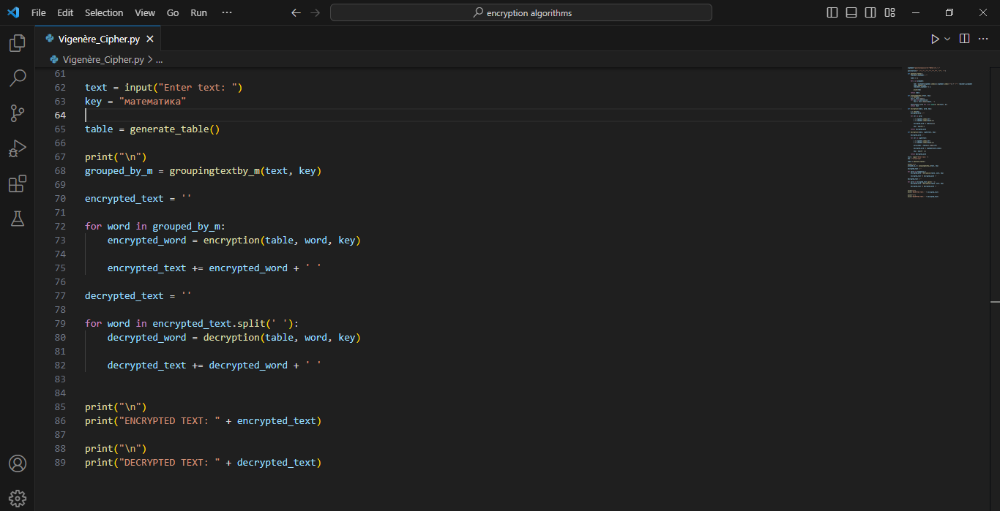
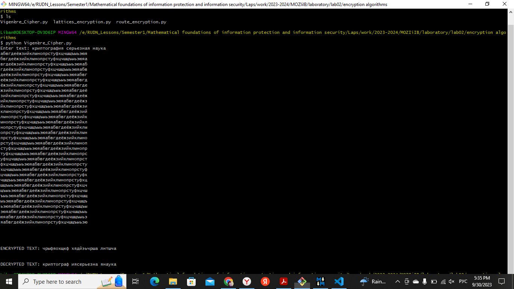

---
# Front matter
title: "Математические основы защиты информации и информационной безопасности. Отчет по лабораторной работе № 2"
subtitle: "Шифры перестановка"
author: "Мохамед Либан Абдуллахи"
group: НФИмд-01-23
institute: Факультет физико-математических и естественных наук, РУДН.

# Generic otions
lang: ru-RU
toc-title: "Содержание"

# Bibliography
csl: pandoc/csl/gost-r-7-0-5-2008-numeric.csl

# Pdf output format
toc: true # Table of contents
toc_depth: 2
lof: true # List of figures
lot: true # List of tables
fontsize: 12pt
linestretch: 1.5
papersize: a4
documentclass: scrreprt
### Fonts
mainfont: PT Serif
romanfont: PT Serif
sansfont: PT Sans
monofont: PT Mono
mainfontoptions: Ligatures=TeX
romanfontoptions: Ligatures=TeX
sansfontoptions: Ligatures=TeX,Scale=MatchLowercase
monofontoptions: Scale=MatchLowercase,Scale=0.9
## Biblatex
biblatex: true
biblio-style: "gost-numeric"
biblatexoptions:
  - parentracker=true
  - backend=biber
  - hyperref=auto
  - language=auto
  - autolang=other*
  - citestyle=gost-numeric
## Misc options
indent: true
header-includes:
  - \linepenalty=10 # the penalty added to the badness of each line within a paragraph (no associated penalty node) Increasing the value makes tex try to have fewer lines in the paragraph.
  - \interlinepenalty=0 # value of the penalty (node) added after each line of a paragraph.
  - \hyphenpenalty=50 # the penalty for line breaking at an automatically inserted hyphen
  - \exhyphenpenalty=50 # the penalty for line breaking at an explicit hyphen
  - \binoppenalty=700 # the penalty for breaking a line at a binary operator
  - \relpenalty=500 # the penalty for breaking a line at a relation
  - \clubpenalty=150 # extra penalty for breaking after first line of a paragraph
  - \widowpenalty=150 # extra penalty for breaking before last line of a paragraph
  - \displaywidowpenalty=50 # extra penalty for breaking before last line before a display math
  - \brokenpenalty=100 # extra penalty for page breaking after a hyphenated line
  - \predisplaypenalty=10000 # penalty for breaking before a display
  - \postdisplaypenalty=0 # penalty for breaking after a display
  - \floatingpenalty = 20000 # penalty for splitting an insertion (can only be split footnote in standard LaTeX)
  - \raggedbottom # or \flushbottom
  - \usepackage{float} # keep figures where there are in the text
  - \floatplacement{figure}{H} # keep figures where there are in the text

---

# Цель работы
Освоить на практике применение Шифры перестановка используя методы марширутное шифрование, шифрование с помощью решеток и таблица виженера.

# Задание

1 марширутное шифрование.

2 шифрование с помощью решеток.

3 таблица виженера.

# Выполнение марширутное шифрование

Для выполнения работы была написана программа (@fig:1 - @fig:3) с помощью языка программирования Python, в исходном коде есть две фнукции, функция groupingtextby_m(), получает две параметри в качестве параметра исходный текст и ключ, и группирует исходного тескт используя ключа, затем функция encryption принимает группируемый текст и шифрует методом марширутное шифрование.

{#fig:1 width=100%}
{#fig:2 width=100%}
{#fig:3 width=100%}

# Выполнение шифрование с помощью решеток

Для выполнения работы была написана программа (@fig:1 - @fig:2) с помощью языка программирования Python, в исходном коде есть две фнукции, Функция транспонирования берет таблицу размером 4x4, представленную в виде кортежа строк, и поворачивает ее на 90 градусов по часовой стрелке, перебирая столбцы и меняя местами символы в каждом столбце, функция recall_password принимает два аргумента: таблицу 4x4 с заполнителями 'X' и таблицу кодов 4x4. и шифрует методом шифрование с помощью решеток.

{#fig:1 width=100%}
{#fig:2 width=100%}

# Выполнение таблица виженера

Для выполнения работы была написана программа (@fig:1 - @fig:4) с помощью языка программирования Python, функция generate_table() генерирует таблицу используя алфавиты, groupingtextby_m() получает две параметри в качестве параметра исходный текст и ключ, и группирует исходного тескт используя ключа, затем функция encryption и decryption принимает таблицу, слова которое будем шифровать или расшифровать и ключ затем шифрует/расшифрует методом шифрование виженера.

{#fig:1 width=100%}
{#fig:2 width=100%}
{#fig:3 width=100%}
{#fig:4 width=100%}

# Выводы
Освоено на практике применение Шифры перестановка используя методы марширутное шифрование, шифрование с помощью решеток и таблица виженера.

# Список литературы
1. Методические материалы курса
