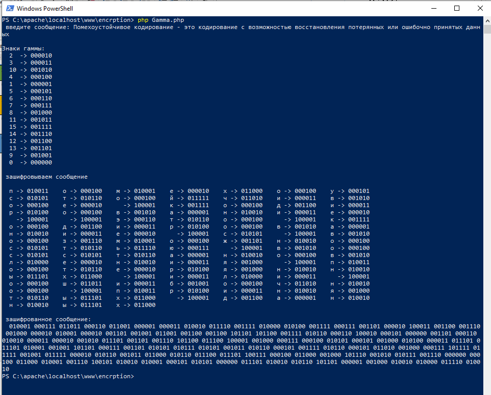

---
## Front matter
lang: ru-RU
title: Математические основы защиты информации и информационной безопасности. Презентация по лабораторной работе № 3 на тему "шифрование гаммированием"
author: Мохамед Либан Абдуллахи
group: НФИмд-01-23
institute: Факультет физико-математических и естественных наук, РУДН.

## Formatting
toc: false
slide_level: 2
theme: metropolis
header-includes: 
 - \metroset{progressbar=frametitle,sectionpage=progressbar,numbering=fraction}
 - '\makeatletter'
 - '\beamer@ignorenonframefalse'
 - '\makeatother'
aspectratio: 43
section-titles: true
---

# Содержание
* Цели и задачи
* Выполнение Работы
* Результаты Работа
* Список литературы

# Цели и задачи
Освоить на практике применение алгоритма шифрования методом гаммирования.
Реализовать алгоритм шивроание гаммированием.

# Выполнение Работы
Для выполнения работы была написана программа с помощью языка программирования PHP.

Зашифруем следующее предложение методом гаммирования.
«Помехоустойчивое кодирование – это кодирование с возможностью восстановления потерянных или ошибочно принятых данных.»
Знаки гаммы: 2 3 10 4 1 5 6 7 8 11 15 14 12 13 9 0.
Шифрование происходит в цикле (знак гаммы повторяется циклически).

## Результаты Работа

# Выводы
Освоено на практике применение алгоритма шифрования методом гаммирования.
Реализовал алгоритм шивроание гаммированием.

# Список литературы
1. Методические материалы курса