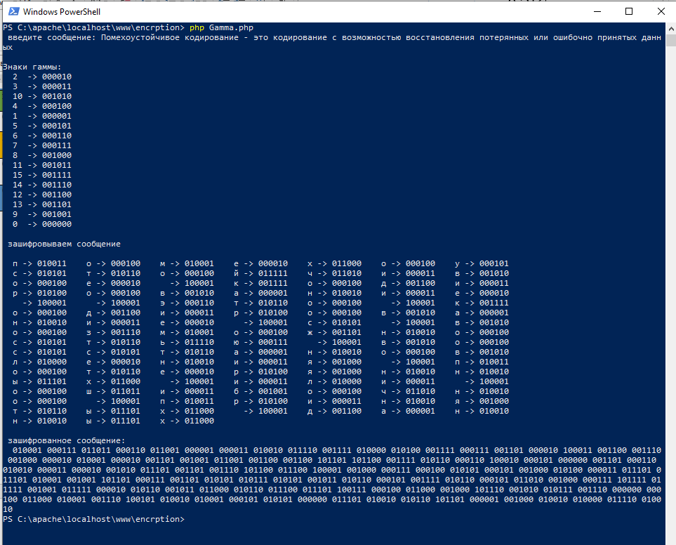

---
# Front matter
title: "Математические основы защиты информации и информационной безопасности. Отчет по лабораторной работе № 3"
subtitle: "шифрование гаммированием"
author: "Мохамед Либан Абдуллахи"
group: НФИмд-01-23
institute: Факультет физико-математических и естественных наук, РУДН.

# Generic otions
lang: ru-RU
toc-title: "Содержание"

# Bibliography
csl: pandoc/csl/gost-r-7-0-5-2008-numeric.csl

# Pdf output format
toc: true # Table of contents
toc_depth: 2
lof: true # List of figures
lot: true # List of tables
fontsize: 12pt
linestretch: 1.5
papersize: a4
documentclass: scrreprt
### Fonts
mainfont: PT Serif
romanfont: PT Serif
sansfont: PT Sans
monofont: PT Mono
mainfontoptions: Ligatures=TeX
romanfontoptions: Ligatures=TeX
sansfontoptions: Ligatures=TeX,Scale=MatchLowercase
monofontoptions: Scale=MatchLowercase,Scale=0.9
## Biblatex
biblatex: true
biblio-style: "gost-numeric"
biblatexoptions:
  - parentracker=true
  - backend=biber
  - hyperref=auto
  - language=auto
  - autolang=other*
  - citestyle=gost-numeric
## Misc options
indent: true
header-includes:
  - \linepenalty=10 # the penalty added to the badness of each line within a paragraph (no associated penalty node) Increasing the value makes tex try to have fewer lines in the paragraph.
  - \interlinepenalty=0 # value of the penalty (node) added after each line of a paragraph.
  - \hyphenpenalty=50 # the penalty for line breaking at an automatically inserted hyphen
  - \exhyphenpenalty=50 # the penalty for line breaking at an explicit hyphen
  - \binoppenalty=700 # the penalty for breaking a line at a binary operator
  - \relpenalty=500 # the penalty for breaking a line at a relation
  - \clubpenalty=150 # extra penalty for breaking after first line of a paragraph
  - \widowpenalty=150 # extra penalty for breaking before last line of a paragraph
  - \displaywidowpenalty=50 # extra penalty for breaking before last line before a display math
  - \brokenpenalty=100 # extra penalty for page breaking after a hyphenated line
  - \predisplaypenalty=10000 # penalty for breaking before a display
  - \postdisplaypenalty=0 # penalty for breaking after a display
  - \floatingpenalty = 20000 # penalty for splitting an insertion (can only be split footnote in standard LaTeX)
  - \raggedbottom # or \flushbottom
  - \usepackage{float} # keep figures where there are in the text
  - \floatplacement{figure}{H} # keep figures where there are in the text

---

# Цель работы
Освоить на практике применение алгоритма шифрования методом гаммирования.

# Задание
Реализовать алгоритм шивроание гаммированием.

# Выполнение Работы

Для выполнения работы была написана программа с помощью языка программирования PHP.
Зашифруем следующее предложение методом гаммирования.
«Помехоустойчивое кодирование – это кодирование с возможностью восстановления потерянных или ошибочно принятых данных.»
Знаки гаммы: 2 3 10 4 1 5 6 7 8 11 15 14 12 13 9 0.
Шифрование происходит в цикле (знак гаммы повторяется циклически).

# Исходный код

<?php 

    function mod_add($binone, $bintwo){
        $binone = preg_split("//u", $binone, -1, PREG_SPLIT_NO_EMPTY);
        $bintwo = preg_split("//u", $bintwo, -1, PREG_SPLIT_NO_EMPTY);

        $result="";
        for($i=0; $i<count($binone); $i++){
            $result.=($binone[$i]+$bintwo[$i])%2;
        }

        return $result;
    }

    function decrypt_mod_add($binone, $bintwo){
        $binone = preg_split("//u", $binone, -1, PREG_SPLIT_NO_EMPTY);
        $bintwo = preg_split("//u", $bintwo, -1, PREG_SPLIT_NO_EMPTY);

        $result="";
        for($i=0; $i<count($binone); $i++){
            if($binone[$i]==$bintwo[$i]){
                $result.="0";
            } else $result.="1";   
        }

        return $result;
    }

   $alphabet = ["а"=>"000001", "б"=>"001001", "в"=>"001010",
                "г"=>"001011", "д"=>"001100", "е"=>"000010",
                "ж"=>"001101", "з"=>"001110", "и"=>"000011",
                "й"=>"011111", "к"=>"001111", "л"=>"010000", 
                "м"=>"010001", "н"=>"010010", "о"=>"000100", 
                "п"=>"010011", "р"=>"010100", "с"=>"010101", 
                "т"=>"010110", "у"=>"000101", "ф"=>"010111", 
                "х"=>"011000", "ц"=>"011001", "ч"=>"011010", 
                "ш"=>"011011", "щ"=>"011100", "ъ"=>"100000",
                "ы"=>"011101", "ь"=>"011110", "э"=>"000110", 
                "ю"=>"000111", "я"=>"001000", " "=>"100001"];

    $gammy_signs = [2, 3, 10, 4, 1, 5, 6, 7, 8, 11, 15, 14, 12, 13, 9, 0];
    $gammy_signs_binary = [];

    $msg=readline(" введите сообщение: ");

    //Двоичное представление знаков гаммы
    foreach ($gammy_signs as $sign){
        $s=decbin($sign);
        $len=strlen($s);
        for ($i=0; $i<6-$len; $i++){
            $s="0".$s;
        }
        array_push($gammy_signs_binary, $s);
    }
    echo "\nЗнаки гаммы: \n";
    for($i=0; $i<count($gammy_signs); $i++){
        if(strlen($gammy_signs[$i])==2)
            echo "  ".$gammy_signs[$i]." -> ".$gammy_signs_binary[$i]."\n";
        else echo "  ".$gammy_signs[$i]."  -> ".$gammy_signs_binary[$i]."\n";
    }

    echo "\n зашифровываем сообщение\n\n";

            //удаляем пробелы и знаки препинания из сообщения
            $msg=mb_strtolower($msg);
            $array_of_characters = array(".", ",", "-", ":");
            foreach($array_of_characters as $character) 
                $msg=str_replace($character, '',$msg);

            //делаем массив из строки
            $msg = preg_split("//u", $msg, -1, PREG_SPLIT_NO_EMPTY);

            //каждой букве сообщения присваиваем двоичный код из алфавита
            $msg_binary=[];
            foreach($msg as $ms){
                array_push($msg_binary, $alphabet[$ms]);
            }

            $j=1;
            for($i=0; $i<count($msg); $i++){
                echo "  ".$msg[$i]." -> ".$msg_binary[$i]."  ";
                if (($j++)%7==0) echo "\n";
            }

            //сложение по модулю 2
            $j=0; $result="";
            for($i=0; $i<count($msg_binary); $i++){
                if ($j<count($gammy_signs_binary)){
                    $result.=mod_add($msg_binary[$i], $gammy_signs_binary[$j])." ";
                    $j++;
                }
                else{
                    $result.=mod_add($msg_binary[$i], $gammy_signs_binary[0])." ";
                    $j=1;
                }
            }

            echo "\n\n зашифрованное сообщение: \n  ".$result."\n";
?>

# Результать Работы

{#fig:1 width=100%}

# Выводы
Освоено нна практике применение алгоритма шифрования методом гаммирования.

# Список литературы
1. Методические материалы курса
