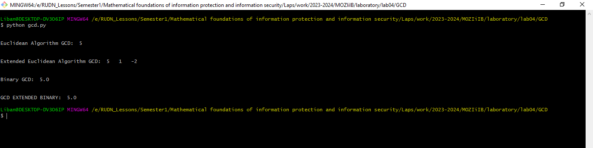

---
## Front matter
lang: ru-RU
title: Математические основы защиты информации и информационной безопасности. Презентация по лабораторной работе № 4 на тему "Вычисление наибольшего общего делителя"
author: Мохамед Либан Абдуллахи
group: НФИмд-01-23
institute: Факультет физико-математических и естественных наук, РУДН.

## Formatting
toc: false
slide_level: 2
theme: metropolis
header-includes: 
 - \metroset{progressbar=frametitle,sectionpage=progressbar,numbering=fraction}
 - '\makeatletter'
 - '\beamer@ignorenonframefalse'
 - '\makeatother'
aspectratio: 43
section-titles: true
---

# Содержание
* Цели и задачи
* Выполнение Работы
* Результаты Работа
* Список литературы

# Цели и задачи
Освоить на практике применение алгоритма Вычисление наибольшего общего делителя.
Реализовать алгоритма Вычисление наибольшего общего делителя.

# Выполнение Работы
Для выполнения работы была написана программа с помощью языка программирования Python. Программа вычисляет алгоритма нахождение наибольшего общего делителя.

## Результаты Работа

# Выводы
Освоено на практике применение алгоритма Вычисление наибольшего общего делителя.
Реализовал алгоритма Вычисление наибольшего общего делителя.

# Список литературы
1. Методические материалы курса