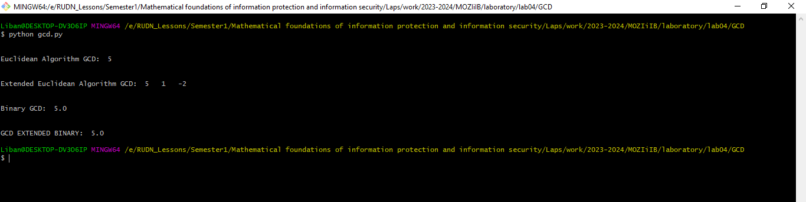

---
# Front matter
title: "Математические основы защиты информации и информационной безопасности. Отчет по лабораторной работе № 4"
subtitle: "Вычисление наибольшего общего делителя"
author: "Мохамед Либан Абдуллахи"
group: НФИмд-01-23
institute: Факультет физико-математических и естественных наук, РУДН.

# Generic otions
lang: ru-RU
toc-title: "Содержание"

# Bibliography
csl: pandoc/csl/gost-r-7-0-5-2008-numeric.csl

# Pdf output format
toc: true # Table of contents
toc_depth: 2
lof: true # List of figures
lot: true # List of tables
fontsize: 12pt
linestretch: 1.5
papersize: a4
documentclass: scrreprt
### Fonts
mainfont: PT Serif
romanfont: PT Serif
sansfont: PT Sans
monofont: PT Mono
mainfontoptions: Ligatures=TeX
romanfontoptions: Ligatures=TeX
sansfontoptions: Ligatures=TeX,Scale=MatchLowercase
monofontoptions: Scale=MatchLowercase,Scale=0.9
## Biblatex
biblatex: true
biblio-style: "gost-numeric"
biblatexoptions:
  - parentracker=true
  - backend=biber
  - hyperref=auto
  - language=auto
  - autolang=other*
  - citestyle=gost-numeric
## Misc options
indent: true
header-includes:
  - \linepenalty=10 # the penalty added to the badness of each line within a paragraph (no associated penalty node) Increasing the value makes tex try to have fewer lines in the paragraph.
  - \interlinepenalty=0 # value of the penalty (node) added after each line of a paragraph.
  - \hyphenpenalty=50 # the penalty for line breaking at an automatically inserted hyphen
  - \exhyphenpenalty=50 # the penalty for line breaking at an explicit hyphen
  - \binoppenalty=700 # the penalty for breaking a line at a binary operator
  - \relpenalty=500 # the penalty for breaking a line at a relation
  - \clubpenalty=150 # extra penalty for breaking after first line of a paragraph
  - \widowpenalty=150 # extra penalty for breaking before last line of a paragraph
  - \displaywidowpenalty=50 # extra penalty for breaking before last line before a display math
  - \brokenpenalty=100 # extra penalty for page breaking after a hyphenated line
  - \predisplaypenalty=10000 # penalty for breaking before a display
  - \postdisplaypenalty=0 # penalty for breaking after a display
  - \floatingpenalty = 20000 # penalty for splitting an insertion (can only be split footnote in standard LaTeX)
  - \raggedbottom # or \flushbottom
  - \usepackage{float} # keep figures where there are in the text
  - \floatplacement{figure}{H} # keep figures where there are in the text

---

# Цель работы
Освоить на практике применение алгоритма Вычисление наибольшего общего делителя.

# Задание
Реализовать алгоритм Вычисление наибольшего общего делителя.

# Выполнение Работы

Для выполнения работы была написана программа с помощью языка программирования Python. Программа вычисляет алгоритма нахождение наибольшего общего делителя.

# Исходный код

def gcd(a, b):
    if a == 0:
        return b
    elif b == 0:
        return a
    
    return gcd(b % a, a)

def gcdExtended(a, b):
 
    # Base Case
    if a == 0:
        return b, 0, 1
 
    gcd, x1, y1 = gcdExtended(b % a, a)
 
    # Update x and y using results of recursive
    # call
    x = y1 - (b//a) * x1
    y = x1
 
    return gcd, x, y
 
def gcdBinary(a, b):
    if (a == 0): return b
    if (b == 0): return a
    if(a == b): return a

    if(a % 2 ==0):
        if(b % 2 == 0):
            return 2 * gcdBinary(a / 2, b / 2)
        else: return gcdBinary(a / 2, b)
    else:
        if(b % 2 ==0): return gcdBinary(a, b / 2)

        else:
            return gcdBinary(abs(a - b), min(a, b))

def gcdExtendedBinary(A, B):
    k = 1
    x, xx, y, yy = 1, 0, 0, 1
 
    while (A != 0) and (B != 0):
        if A > B:
            q = a // b
        else:
            q = b // a
 
        while (A % 2 == 0) and (B % 2 == 0):
            A /= 2
            B /= 2
            k *= 2
 
        while A % 2 == 0:
            A /= 2
        while B % 2 == 0:
            B /= 2
 
        if A >= B:
            A -= B
        else:
            B -= A
 
        x, xx = xx, x - xx * q
        y, yy = yy, y - yy * q
 
    return B * k, x, y

# Driver code
a, b = 35, 15

print("\n")
gcd = gcd(a, b)
print("Euclidean Algorithm GCD: ", gcd)
print("\n")

gcdextended, x, y = gcdExtended(a, b)
print("Extended Euclidean Algorithm GCD: ", gcdextended, " ", x, " ", y)
print("\n")

gBinary = gcdBinary(a, b)
print("Binary GCD: ", gBinary)
print("\n")

gcdExBinary, x, y = gcdExtendedBinary(a, b)
print("GCD EXTENDED BINARY: ", gcdExBinary)

# Результать Работы

{#fig:1 width=100%}

# Выводы
Освоено на практике применение алгоритма Вычисление наибольшего общего делителя.

# Список литературы
1. Методические материалы курса
