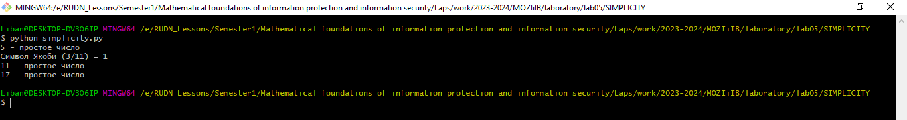

---
# Front matter
title: "Математические основы защиты информации и информационной безопасности. Отчет по лабораторной работе № 5"
subtitle: "Вероятностные алгоритмы проверки чисел на простоту"
author: "Мохамед Либан Абдуллахи"
group: НФИмд-01-23
institute: Факультет физико-математических и естественных наук, РУДН.

# Generic otions
lang: ru-RU
toc-title: "Содержание"

# Bibliography
csl: pandoc/csl/gost-r-7-0-5-2008-numeric.csl

# Pdf output format
toc: true # Table of contents
toc_depth: 2
lof: true # List of figures
lot: true # List of tables
fontsize: 12pt
linestretch: 1.5
papersize: a4
documentclass: scrreprt
### Fonts
mainfont: PT Serif
romanfont: PT Serif
sansfont: PT Sans
monofont: PT Mono
mainfontoptions: Ligatures=TeX
romanfontoptions: Ligatures=TeX
sansfontoptions: Ligatures=TeX,Scale=MatchLowercase
monofontoptions: Scale=MatchLowercase,Scale=0.9
## Biblatex
biblatex: true
biblio-style: "gost-numeric"
biblatexoptions:
  - parentracker=true
  - backend=biber
  - hyperref=auto
  - language=auto
  - autolang=other*
  - citestyle=gost-numeric
## Misc options
indent: true
header-includes:
  - \linepenalty=10 # the penalty added to the badness of each line within a paragraph (no associated penalty node) Increasing the value makes tex try to have fewer lines in the paragraph.
  - \interlinepenalty=0 # value of the penalty (node) added after each line of a paragraph.
  - \hyphenpenalty=50 # the penalty for line breaking at an automatically inserted hyphen
  - \exhyphenpenalty=50 # the penalty for line breaking at an explicit hyphen
  - \binoppenalty=700 # the penalty for breaking a line at a binary operator
  - \relpenalty=500 # the penalty for breaking a line at a relation
  - \clubpenalty=150 # extra penalty for breaking after first line of a paragraph
  - \widowpenalty=150 # extra penalty for breaking before last line of a paragraph
  - \displaywidowpenalty=50 # extra penalty for breaking before last line before a display math
  - \brokenpenalty=100 # extra penalty for page breaking after a hyphenated line
  - \predisplaypenalty=10000 # penalty for breaking before a display
  - \postdisplaypenalty=0 # penalty for breaking after a display
  - \floatingpenalty = 20000 # penalty for splitting an insertion (can only be split footnote in standard LaTeX)
  - \raggedbottom # or \flushbottom
  - \usepackage{float} # keep figures where there are in the text
  - \floatplacement{figure}{H} # keep figures where there are in the text

---

# Цель работы
Освоить на практике применение алгоритмы проверки чисел на простоту.

# Задание
1 Алгоритм, реализующий тест ферма
2 алгоритм вычисления символа якоби
3 Алгоритм, реализующий тест Миллера-Рабина
4 алгоритм реализующий тест соловея-штрассена

# Выполнение Работы

Для выполнения работы была написана программа с помощью языка программирования Python. Программа вычисляет алгоритма проверки чисел на простоту.

# Исходный код

import random

def is_prime(n, k=5):
    """Проверка простоты числа методом Ферма-Рабина."""
    if n <= 1:
        return False
    if n <= 3:
        return True

    # Выполняем тест Ферма k раз
    for _ in range(k):
        a = random.randint(2, n - 2)
        if pow(a, n - 1, n) != 1:
            return False

    return True

# Пример использования
number_to_test = 5
result = is_prime(number_to_test)

if result:
    print(f"{number_to_test} - простое число")
else:
    print(f"{number_to_test} - составное число")

def jacobi_symbol(a, n):
    if n <= 0 or n % 2 == 0:
        raise ValueError("Вторым аргументом должно быть положительное нечетное целое число")

    a = a % n
    result = 1

    while a != 0:
        while a % 2 == 0:
            a /= 2
            r = n % 8
            if r == 3 or r == 5:
                result = -result

        a, n = n, a
        if a % 4 == 3 and n % 4 == 3:
            result = -result

        a %= n

    if n == 1:
        return result
    else:
        return 0

# Пример использования
a = 3
n = 11
result = jacobi_symbol(a, n)
print(f"Символ Якоби ({a}/{n}) = {result}")

def power_mod(base, exponent, modulus):
    result = 1
    base = base % modulus
    while exponent > 0:
        if exponent % 2 == 1:
            result = (result * base) % modulus
        exponent = exponent // 2
        base = (base * base) % modulus
    return result

def jacobi_symbol(a, n):
    if n <= 0 or n % 2 == 0:
        raise ValueError("Вторым аргументом должно быть положительное нечетное целое число")

    a = a % n
    result = 1

    while a != 0:
        while a % 2 == 0:
            a = a / 2
            r = n % 8
            if r == 3 or r == 5:
                result = -result

        a, n = n, a
        if a % 4 == 3 and n % 4 == 3:
            result = -result

        a = a % n

    if n == 1:
        return result
    else:
        return 0

def is_prime_spsp(n, k=5):
    if n == 2 or n == 3:
        return True
    if n == 1 or n % 2 == 0:
        return False

    # Выполняем тест Соловея-Штрассена k раз
    for _ in range(k):
        a = random.randint(2, n - 2)
        x = jacobi_symbol(a, n)
        y = power_mod(a, (n - 1) // 2, n)

        if x == 0 or y != x % n:
            return False

    return True

# Пример использования
number_to_test = 11
result = is_prime_spsp(number_to_test)

if result:
    print(f"{number_to_test} - простое число")
else:
    print(f"{number_to_test} - составное число")

def power_mod(base, exponent, modulus):
    result = 1
    base = base % modulus
    while exponent > 0:
        if exponent % 2 == 1:
            result = (result * base) % modulus
        exponent = exponent // 2
        base = (base * base) % modulus
    return result

def miller_rabin_test(n, k=5):
    if n == 2 or n == 3:
        return True
    if n == 1 or n % 2 == 0:
        return False

    # Представляем n - 1 как d * 2^r, где d нечетное
    r, d = 0, n - 1
    while d % 2 == 0:
        r += 1
        d //= 2

    # Выполняем тест Миллера-Рабина k раз
    for _ in range(k):
        a = random.randint(2, n - 2)
        x = power_mod(a, d, n)

        if x == 1 or x == n - 1:
            continue

        for _ in range(r - 1):
            x = (x * x) % n
            if x == n - 1:
                break
        else:
            return False

    return True

# Пример использования
number_to_test = 17
result = miller_rabin_test(number_to_test)

if result:
    print(f"{number_to_test} - простое число")
else:
    print(f"{number_to_test} - составное число")

# Результать Работы

{#fig:1 width=100%}

# Выводы
Освоено на практике применение алгоритма  алгоритмы проверки чисел на простоту.

# Список литературы
1. Методические материалы курса
